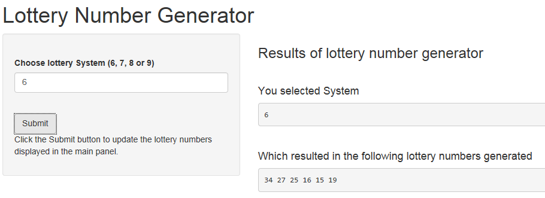

ShinyApp Pitch for "Lottery Number Generator"
========================================================
author: by plsn
date: September 27, 2015
transition: rotate

Why create the ShinyApp "Lottery Number Generator"?
========================================================

- Project assignment for Coursera "Developing Data Products" MOOC course 
- Part of the data science specilization by John Hopkins Bloomberg School of Public Health
- For some fun and hopefully some lucky winnings at the lottery :)

Overview of this ShinyApp
========================================================

- There are a total of 49 numbers out of which 6 numbers are drawn in each week's lottery game
- The entry game is called System 6, whereby you select 6 numbers
- Next is System 7, 8 or 9, whereby you can select 7, 8 or 9 numbers respectively which gives you a higher chance of winning compared to System 6 but of course will cost more to play

ShinyApp Screenshot and Random Number Generator Code
========================================================




```r
system <- 6
sample.int(49,system)
```

```
[1] 14 34 13 48 12  4
```


Try the ShinyApp "Lottery Number Generator" today!
========================================================

- Deployed at [https://plsn.shinyapps.io/DataProductsProject](https://plsn.shinyapps.io/DataProductsProject)
- Code available at: [https://github.com/plsn/DataProductsProject](https://github.com/plsn/DataProductsProject) 
